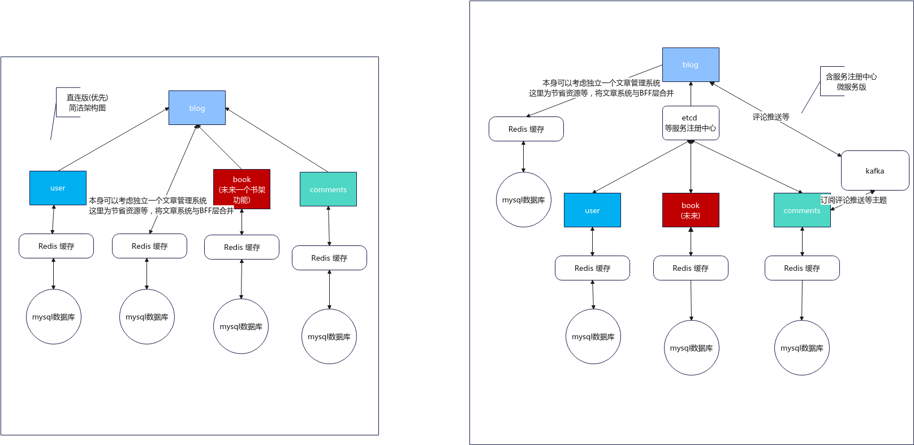

# 项目简介

本项目是对原个人 Java 项目 [qycms](https://gitee.com/windcoder/qycms) 的 GoLang 版改造， 由于时间有限，这一版直接使用了微服务框架 Kratos ，暂时仅简单实现了部分功能以及项目框架，后期根据个人时间安排等实际情况继续完善。已创建的服务为 用户服务、blog服务、评论服务。
- 用户服务(qycms_user)：提供用户管理、授权校验等服务
- blog服务(qycms_blog)：为项目主服务，本身可考虑拆分成BFF层，目前为简化开发，和文章管理等合并在了一起。本身会调用用户服务、评论服务等完成文章发布、浏览、评论等功能。
- 评论服务(qycms_comments)：为项目提供评论管理服务，参考评论系统部分设计实现。



暂时以手边有的etcd作为服务注册与发现，同时加了直连的实现方式，具体选择配置方案需要后期完善。目前仅实现了redis缓存用户信息功能。

## 单个服务架构

以用户为例,主要是app中的接口部分以及app中的服务实现部分。
- api: 所有所用接口均在这里生成，由于基于 grpc，所以也是 dao 所在位置
- app: 创建并管理所有服务
    - cmd 用于启动命令等生成
    - configs 配置文件所在位置
    - internal 服务实现所在位置
        - service：dao 与 do 互转层
        - biz：定义 do,具体业务层，DO 与 PO 互转层
        - data：定义 PO，数据库连接创建以及增删改查等基本服务， PO服务执行层。
        - conf: 定义读取配置文件的对象
        - server: http与grpc协议服务实际注册层，如果需要多个api文件中请求注册到项目中，则需要调整这里面的http或者 grpc 文件，增加类似 `v1.RegisterUserHTTPServer(srv, userService)`的语句。

## 欲实现方案
用户评论功能预架构：
- 用户->blog服务webApi接口->推送kafka
- 评论服务->订阅kafka主题获取评论->保存到数据库中
- 推送kafka为可选部分，根据配置文件决定是否启动
## API 生成
```shell
# 创建api
kratos proto add api/qycms_bff/admin/v1/qy_admin_api_group.proto
kratos proto add api/qycms_bff/web/v1/qy_web_article.proto
# 生成api
kratos proto client api/
```
## API JSON文件生成

暂时需要手动在 Makefile 文件中手动配置需要生成 API 的文件，然后执行 `make swagger` 会在对应的文件夹下面生成json文件

暂时将目前配置的部分接口文档复制到了 doc/api 文件夹下面一份。

# Kratos Project Template

## Install Kratos
```
go install github.com/go-kratos/kratos/cmd/kratos/v2@latest
```
## Create a service
```
# Create a template project
kratos new server

cd server
# Add a proto template
kratos proto add api/server/server.proto
# Generate the proto code
kratos proto client api/server/server.proto
# Generate the source code of service by proto file
kratos proto server api/server/server.proto -t internal/service

go generate ./...
go build -o ./bin/ ./...
./bin/server -conf ./configs
```
## Generate other auxiliary files by Makefile
```
# Download and update dependencies
make init
# Generate API files (include: pb.go, http, grpc, validate, swagger) by proto file
make api
# Generate all files
make all
```
## Automated Initialization (wire)
```
# install wire
go get github.com/google/wire/cmd/wire

# generate wire
cd cmd/server
wire
```

## Docker
```bash
# build
docker build -t <your-docker-image-name> .

# run
docker run --rm -p 8000:8000 -p 9000:9000 -v </path/to/your/configs>:/data/conf <your-docker-image-name>
```

